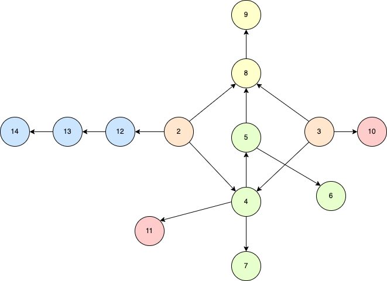

# Machine Learning for Econometrics

📖 Repo for the textbook "Machine Learning for Econometrics" : [Buy online](http://global.oup.com/academic/product/machine-learning-for-econometrics-9780198918820?lang=en&cc=fr)

*Machine Learning for Econometrics* is a book for economists seeking to grasp modern machine learning techniques - from their predictive performance to the revolutionary handling of unstructured data - in order to establish causal relationships from data.

The volume covers automatic variable selection in various high-dimensional contexts, estimation of treatment effect heterogeneity, natural language processing (NLP) techniques, as well as synthetic control and macroeconomic forecasting. The foundations of machine learning methods are introduced to provide both a thorough theoretical treatment of how they can be used in econometrics and numerous economic applications, and each chapter contains a series of empirical examples, programs, and exercises to facilitate the reader's adoption and implementation of the techniques.

* * *

[Christophe GAILLAC](https://www.cgaillac.com/) is an Associate Professor at the University of Geneva, GSEM. He was a postdoctoral prize research fellow at Oxford University and Nuffield College, and received his PhD in Economics from the Toulouse School of Economics.

[Jérémy L’HOUR](https://sites.google.com/site/jeremylhour/home) is a quantitative researcher at Capital Fund Management (CFM), a Paris-based systematic hedge fund. He received his PhD in Economics from Université Paris-Saclay.

* * *

# Table of content

1. Introduction

Part I. Statistics and Econometrics Prerequisites

2. Statistical tools
3. Causal inference

Part II. High-dimension and variable selection

4. Post-selection inference
5. Generalization and methodology
6. High dimension and endogeneity
7. Going further

Part III. Treatment effect heterogeneity

8. Inference on heterogeneous effects
9. Optimal policy learning

Part IV. Aggregated data and macroeconomic forecasting

10. The synthetic control method
11. Forecasting in high-dimension

Part V. Textual data

12. Working with text data
13. Word embeddings
14. Modern language models

Part VI. Exercises

15. Exercises

* * *

# Link between chapters

To help the reader navigate this book, the following figure shows the connection between each chapter, identified by its number. An arrow going from one node to another indicates that the originating chapter is a prerequisite for understanding the destination chapter. Apart from Chapters 2 and 3, which are not central to the main discussion, the reader may start with Chapters 4, 8, or 12, which are the first chapters of the second, third, and fifth parts respectively, or with either of the two chapters in the fourth part.

